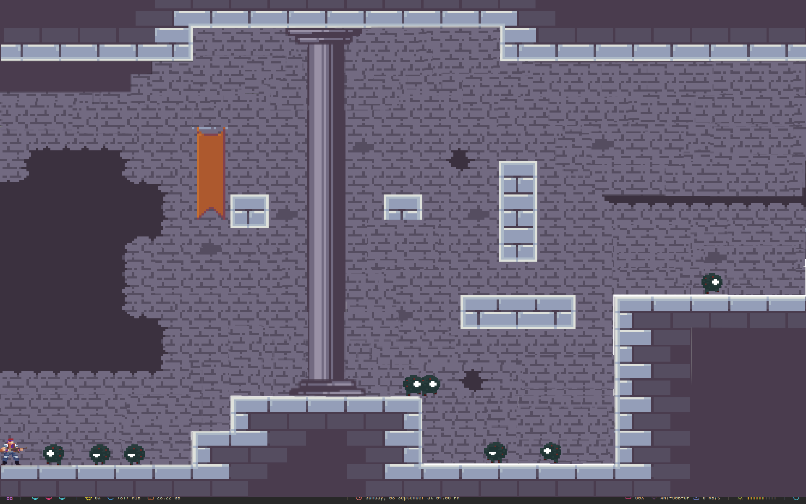

# 2D platformer in SDL


Implemented a Custom ECS to handle entity properties





## Installation

Make sure you have SDL installed prior to compiling  
To check:-

```bash
sdl2-config --version
```

Moving onto the installation:-
```bash
  git clone https://github.com/NidhishSingh68/Platformer.git
  cd Platformer
  cd src
  mkdir build
  cmake ..
  make
```
    
